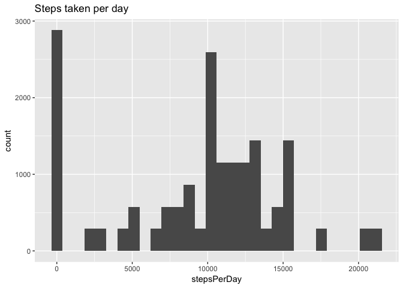
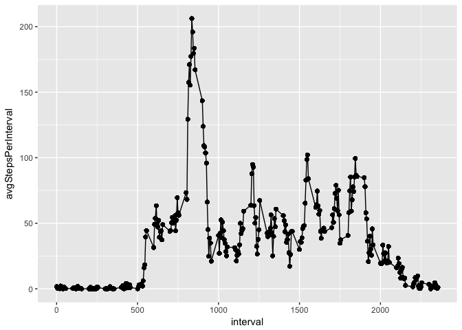
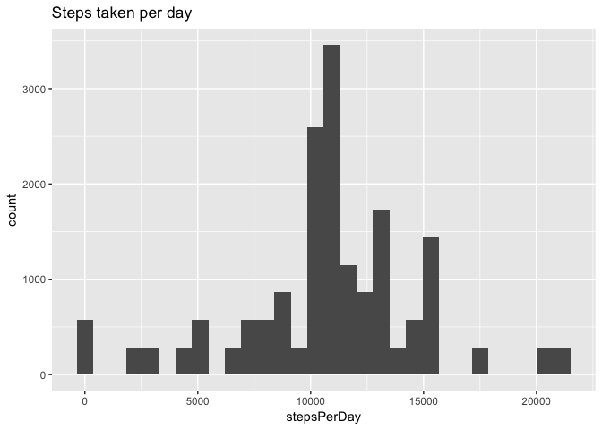
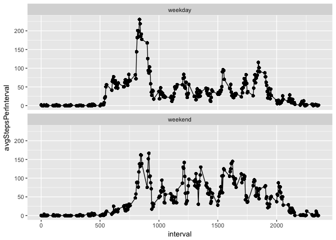

# Reproducible Research: Peer Assessment 1


## Loading and preprocessing the data

```r
# check dependencies
        if (!require(data.table)){
                install.packages("data.table")
                require(data.table)
        }
        if (!require(ggplot2)){
                install.packages("ggplot2")
                require(ggplot2)
        }
# read data from zip file
data <- unzip(zipfile = "activity.zip")
activity <- fread(input = data[grep(pattern = "activity.csv", x = data)]) 
```


## What is mean total number of steps taken per day?

```r
activity[, stepsPerDay := sum(steps, na.rm = T), by = .(date)]
```

```
##        steps       date interval stepsPerDay
##     1:    NA 2012-10-01        0           0
##     2:    NA 2012-10-01        5           0
##     3:    NA 2012-10-01       10           0
##     4:    NA 2012-10-01       15           0
##     5:    NA 2012-10-01       20           0
##    ---                                      
## 17564:    NA 2012-11-30     2335           0
## 17565:    NA 2012-11-30     2340           0
## 17566:    NA 2012-11-30     2345           0
## 17567:    NA 2012-11-30     2350           0
## 17568:    NA 2012-11-30     2355           0
```

```r
qplot(stepsPerDay, data = activity, geom = "histogram", main = "Steps taken per day")
```

```
## `stat_bin()` using `bins = 30`. Pick better value with `binwidth`.
```

<!-- -->

```r
print(paste("Mean:", activity[,mean(stepsPerDay)], sep = " "))
```

```
## [1] "Mean: 9354.22950819672"
```

```r
print(paste("Median:", activity[,median(stepsPerDay)], sep = " "))
```

```
## [1] "Median: 10395"
```

## What is the average daily activity pattern?

```r
activity[, avgStepsPerInterval := mean(steps, na.rm = T), by = .(interval)]
```

```
##        steps       date interval stepsPerDay avgStepsPerInterval
##     1:    NA 2012-10-01        0           0           1.7169811
##     2:    NA 2012-10-01        5           0           0.3396226
##     3:    NA 2012-10-01       10           0           0.1320755
##     4:    NA 2012-10-01       15           0           0.1509434
##     5:    NA 2012-10-01       20           0           0.0754717
##    ---                                                          
## 17564:    NA 2012-11-30     2335           0           4.6981132
## 17565:    NA 2012-11-30     2340           0           3.3018868
## 17566:    NA 2012-11-30     2345           0           0.6415094
## 17567:    NA 2012-11-30     2350           0           0.2264151
## 17568:    NA 2012-11-30     2355           0           1.0754717
```

```r
qplot(data = activity, x = interval, y = avgStepsPerInterval) + geom_line()
```

<!-- -->

```r
print(paste("Max number of steps at interval:", activity[which.max(avgStepsPerInterval), interval], sep = " "))
```

```
## [1] "Max number of steps at interval: 835"
```


## Imputing missing values

```r
print(paste("Number of missing values in dataset:", sum(is.na(activity)), sep = " "))
```

```
## [1] "Number of missing values in dataset: 2304"
```

```r
filled <- copy(activity)
filled[is.na(steps), steps := as.integer(avgStepsPerInterval)]
```

```
##        steps       date interval stepsPerDay avgStepsPerInterval
##     1:     1 2012-10-01        0           0           1.7169811
##     2:     0 2012-10-01        5           0           0.3396226
##     3:     0 2012-10-01       10           0           0.1320755
##     4:     0 2012-10-01       15           0           0.1509434
##     5:     0 2012-10-01       20           0           0.0754717
##    ---                                                          
## 17564:     4 2012-11-30     2335           0           4.6981132
## 17565:     3 2012-11-30     2340           0           3.3018868
## 17566:     0 2012-11-30     2345           0           0.6415094
## 17567:     0 2012-11-30     2350           0           0.2264151
## 17568:     1 2012-11-30     2355           0           1.0754717
```

```r
filled[, stepsPerDay := sum(steps, na.rm = T), by = .(date)]
```

```
##        steps       date interval stepsPerDay avgStepsPerInterval
##     1:     1 2012-10-01        0       10641           1.7169811
##     2:     0 2012-10-01        5       10641           0.3396226
##     3:     0 2012-10-01       10       10641           0.1320755
##     4:     0 2012-10-01       15       10641           0.1509434
##     5:     0 2012-10-01       20       10641           0.0754717
##    ---                                                          
## 17564:     4 2012-11-30     2335       10641           4.6981132
## 17565:     3 2012-11-30     2340       10641           3.3018868
## 17566:     0 2012-11-30     2345       10641           0.6415094
## 17567:     0 2012-11-30     2350       10641           0.2264151
## 17568:     1 2012-11-30     2355       10641           1.0754717
```

```r
qplot(stepsPerDay, data = filled, geom = "histogram", main = "Steps taken per day")
```

```
## `stat_bin()` using `bins = 30`. Pick better value with `binwidth`.
```

<!-- -->

```r
print(paste("Mean:", filled[,mean(stepsPerDay)], sep = " "))
```

```
## [1] "Mean: 10749.7704918033"
```

```r
print(paste("Median:", filled[,median(stepsPerDay)], sep = " "))
```

```
## [1] "Median: 10641"
```

## Are there differences in activity patterns between weekdays and weekends?

```r
setkey(filled, "date")
filled[, dayOfWeek := weekdays(as.Date(date))]
```

```
##        steps       date interval stepsPerDay avgStepsPerInterval dayOfWeek
##     1:     1 2012-10-01        0       10641           1.7169811    Monday
##     2:     0 2012-10-01        5       10641           0.3396226    Monday
##     3:     0 2012-10-01       10       10641           0.1320755    Monday
##     4:     0 2012-10-01       15       10641           0.1509434    Monday
##     5:     0 2012-10-01       20       10641           0.0754717    Monday
##    ---                                                                    
## 17564:     4 2012-11-30     2335       10641           4.6981132    Friday
## 17565:     3 2012-11-30     2340       10641           3.3018868    Friday
## 17566:     0 2012-11-30     2345       10641           0.6415094    Friday
## 17567:     0 2012-11-30     2350       10641           0.2264151    Friday
## 17568:     1 2012-11-30     2355       10641           1.0754717    Friday
```

```r
filled[dayOfWeek %in% list("Saturday", "Sunday"), type := "weekend"]
```

```
##        steps       date interval stepsPerDay avgStepsPerInterval dayOfWeek
##     1:     1 2012-10-01        0       10641           1.7169811    Monday
##     2:     0 2012-10-01        5       10641           0.3396226    Monday
##     3:     0 2012-10-01       10       10641           0.1320755    Monday
##     4:     0 2012-10-01       15       10641           0.1509434    Monday
##     5:     0 2012-10-01       20       10641           0.0754717    Monday
##    ---                                                                    
## 17564:     4 2012-11-30     2335       10641           4.6981132    Friday
## 17565:     3 2012-11-30     2340       10641           3.3018868    Friday
## 17566:     0 2012-11-30     2345       10641           0.6415094    Friday
## 17567:     0 2012-11-30     2350       10641           0.2264151    Friday
## 17568:     1 2012-11-30     2355       10641           1.0754717    Friday
##        type
##     1:   NA
##     2:   NA
##     3:   NA
##     4:   NA
##     5:   NA
##    ---     
## 17564:   NA
## 17565:   NA
## 17566:   NA
## 17567:   NA
## 17568:   NA
```

```r
filled[!dayOfWeek %in% list("Saturday", "Sunday"), type := "weekday"]
```

```
##        steps       date interval stepsPerDay avgStepsPerInterval dayOfWeek
##     1:     1 2012-10-01        0       10641           1.7169811    Monday
##     2:     0 2012-10-01        5       10641           0.3396226    Monday
##     3:     0 2012-10-01       10       10641           0.1320755    Monday
##     4:     0 2012-10-01       15       10641           0.1509434    Monday
##     5:     0 2012-10-01       20       10641           0.0754717    Monday
##    ---                                                                    
## 17564:     4 2012-11-30     2335       10641           4.6981132    Friday
## 17565:     3 2012-11-30     2340       10641           3.3018868    Friday
## 17566:     0 2012-11-30     2345       10641           0.6415094    Friday
## 17567:     0 2012-11-30     2350       10641           0.2264151    Friday
## 17568:     1 2012-11-30     2355       10641           1.0754717    Friday
##           type
##     1: weekday
##     2: weekday
##     3: weekday
##     4: weekday
##     5: weekday
##    ---        
## 17564: weekday
## 17565: weekday
## 17566: weekday
## 17567: weekday
## 17568: weekday
```

```r
filled[,type:= as.factor(type)]
```

```
##        steps       date interval stepsPerDay avgStepsPerInterval dayOfWeek
##     1:     1 2012-10-01        0       10641           1.7169811    Monday
##     2:     0 2012-10-01        5       10641           0.3396226    Monday
##     3:     0 2012-10-01       10       10641           0.1320755    Monday
##     4:     0 2012-10-01       15       10641           0.1509434    Monday
##     5:     0 2012-10-01       20       10641           0.0754717    Monday
##    ---                                                                    
## 17564:     4 2012-11-30     2335       10641           4.6981132    Friday
## 17565:     3 2012-11-30     2340       10641           3.3018868    Friday
## 17566:     0 2012-11-30     2345       10641           0.6415094    Friday
## 17567:     0 2012-11-30     2350       10641           0.2264151    Friday
## 17568:     1 2012-11-30     2355       10641           1.0754717    Friday
##           type
##     1: weekday
##     2: weekday
##     3: weekday
##     4: weekday
##     5: weekday
##    ---        
## 17564: weekday
## 17565: weekday
## 17566: weekday
## 17567: weekday
## 17568: weekday
```

```r
filled[, avgStepsPerInterval := mean(steps, na.rm = T), by = .(interval, type)]
```

```
##        steps       date interval stepsPerDay avgStepsPerInterval dayOfWeek
##     1:     1 2012-10-01        0       10641          2.15555556    Monday
##     2:     0 2012-10-01        5       10641          0.40000000    Monday
##     3:     0 2012-10-01       10       10641          0.15555556    Monday
##     4:     0 2012-10-01       15       10641          0.17777778    Monday
##     5:     0 2012-10-01       20       10641          0.08888889    Monday
##    ---                                                                    
## 17564:     4 2012-11-30     2335       10641          2.15555556    Friday
## 17565:     3 2012-11-30     2340       10641          2.20000000    Friday
## 17566:     0 2012-11-30     2345       10641          0.17777778    Friday
## 17567:     0 2012-11-30     2350       10641          0.26666667    Friday
## 17568:     1 2012-11-30     2355       10641          1.40000000    Friday
##           type
##     1: weekday
##     2: weekday
##     3: weekday
##     4: weekday
##     5: weekday
##    ---        
## 17564: weekday
## 17565: weekday
## 17566: weekday
## 17567: weekday
## 17568: weekday
```

```r
qplot(data = filled, x = interval, y = avgStepsPerInterval, facets = .~type) + geom_line() + facet_wrap(nrow = 2, ncol = 1, facets = ~type)
```

<!-- -->
