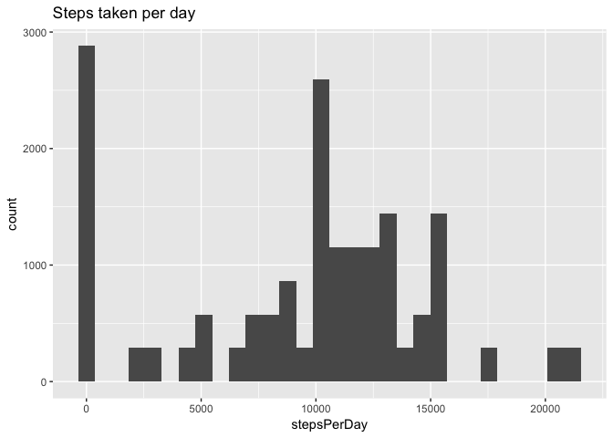
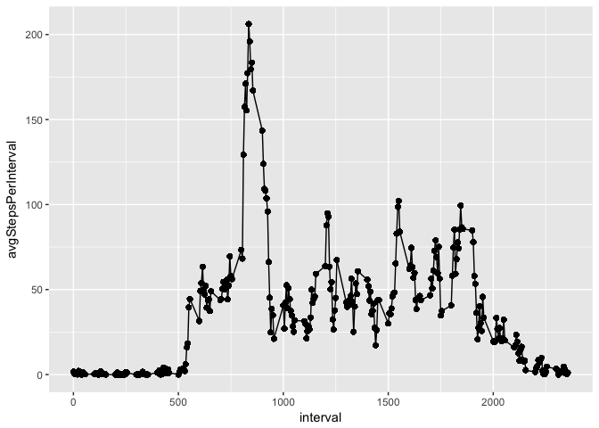
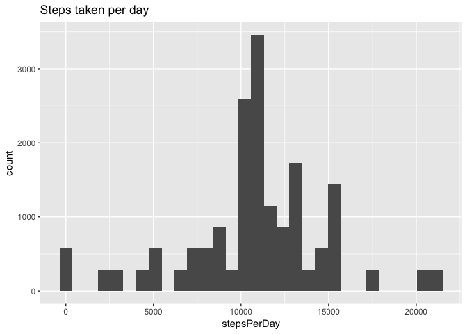
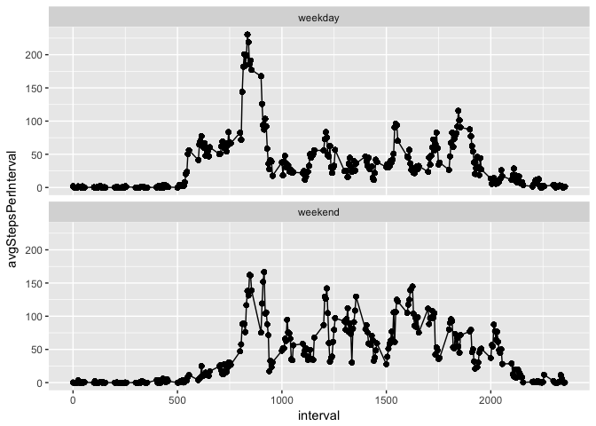

# Reproducible Research: Peer Assessment 1


## Loading and preprocessing the data

```r
# check dependencies
        if (!require(data.table)){
                install.packages("data.table")
                require(data.table)
        }
        if (!require(ggplot2)){
                install.packages("ggplot2")
                require(ggplot2)
        }
# read data from zip file
data <- unzip(zipfile = "activity.zip")
activity <- fread(input = data[grep(pattern = "activity.csv", x = data)]) 
```


## What is mean total number of steps taken per day?

```r
activity[, stepsPerDay := sum(steps, na.rm = T), by = .(date)]
```

```
##        steps       date interval stepsPerDay
##     1:    NA 2012-10-01        0           0
##     2:    NA 2012-10-01        5           0
##     3:    NA 2012-10-01       10           0
##     4:    NA 2012-10-01       15           0
##     5:    NA 2012-10-01       20           0
##    ---                                      
## 17564:    NA 2012-11-30     2335           0
## 17565:    NA 2012-11-30     2340           0
## 17566:    NA 2012-11-30     2345           0
## 17567:    NA 2012-11-30     2350           0
## 17568:    NA 2012-11-30     2355           0
```

```r
qplot(stepsPerDay, data = activity, geom = "histogram", main = "Steps taken per day")
```

```
## `stat_bin()` using `bins = 30`. Pick better value with `binwidth`.
```

<!-- -->

```r
print(paste("Mean:", activity[,mean(stepsPerDay)], sep = " "))
```

```
## [1] "Mean: 9354.22950819672"
```

```r
print(paste("Median:", activity[,median(stepsPerDay)], sep = " "))
```

```
## [1] "Median: 10395"
```

## What is the average daily activity pattern?

```r
activity[, avgStepsPerInterval := mean(steps, na.rm = T), by = .(interval)]
```

```
##        steps       date interval stepsPerDay avgStepsPerInterval
##     1:    NA 2012-10-01        0           0           1.7169811
##     2:    NA 2012-10-01        5           0           0.3396226
##     3:    NA 2012-10-01       10           0           0.1320755
##     4:    NA 2012-10-01       15           0           0.1509434
##     5:    NA 2012-10-01       20           0           0.0754717
##    ---                                                          
## 17564:    NA 2012-11-30     2335           0           4.6981132
## 17565:    NA 2012-11-30     2340           0           3.3018868
## 17566:    NA 2012-11-30     2345           0           0.6415094
## 17567:    NA 2012-11-30     2350           0           0.2264151
## 17568:    NA 2012-11-30     2355           0           1.0754717
```

```r
qplot(data = activity, x = interval, y = avgStepsPerInterval) + geom_line()
```

<!-- -->

```r
print(paste("Max number of steps at interval:", activity[which.max(steps), interval], sep = " "))
```

```
## [1] "Max number of steps at interval: 615"
```


## Imputing missing values

```r
print(paste("Number of missing values in dataset:", sum(is.na(activity)), sep = " "))
```

```
## [1] "Number of missing values in dataset: 2304"
```

```r
filled <- copy(activity)
filled[is.na(steps), interval]
```

```
##    [1]    0    5   10   15   20   25   30   35   40   45   50   55  100
##   [14]  105  110  115  120  125  130  135  140  145  150  155  200  205
##   [27]  210  215  220  225  230  235  240  245  250  255  300  305  310
##   [40]  315  320  325  330  335  340  345  350  355  400  405  410  415
##   [53]  420  425  430  435  440  445  450  455  500  505  510  515  520
##   [66]  525  530  535  540  545  550  555  600  605  610  615  620  625
##   [79]  630  635  640  645  650  655  700  705  710  715  720  725  730
##   [92]  735  740  745  750  755  800  805  810  815  820  825  830  835
##  [105]  840  845  850  855  900  905  910  915  920  925  930  935  940
##  [118]  945  950  955 1000 1005 1010 1015 1020 1025 1030 1035 1040 1045
##  [131] 1050 1055 1100 1105 1110 1115 1120 1125 1130 1135 1140 1145 1150
##  [144] 1155 1200 1205 1210 1215 1220 1225 1230 1235 1240 1245 1250 1255
##  [157] 1300 1305 1310 1315 1320 1325 1330 1335 1340 1345 1350 1355 1400
##  [170] 1405 1410 1415 1420 1425 1430 1435 1440 1445 1450 1455 1500 1505
##  [183] 1510 1515 1520 1525 1530 1535 1540 1545 1550 1555 1600 1605 1610
##  [196] 1615 1620 1625 1630 1635 1640 1645 1650 1655 1700 1705 1710 1715
##  [209] 1720 1725 1730 1735 1740 1745 1750 1755 1800 1805 1810 1815 1820
##  [222] 1825 1830 1835 1840 1845 1850 1855 1900 1905 1910 1915 1920 1925
##  [235] 1930 1935 1940 1945 1950 1955 2000 2005 2010 2015 2020 2025 2030
##  [248] 2035 2040 2045 2050 2055 2100 2105 2110 2115 2120 2125 2130 2135
##  [261] 2140 2145 2150 2155 2200 2205 2210 2215 2220 2225 2230 2235 2240
##  [274] 2245 2250 2255 2300 2305 2310 2315 2320 2325 2330 2335 2340 2345
##  [287] 2350 2355    0    5   10   15   20   25   30   35   40   45   50
##  [300]   55  100  105  110  115  120  125  130  135  140  145  150  155
##  [313]  200  205  210  215  220  225  230  235  240  245  250  255  300
##  [326]  305  310  315  320  325  330  335  340  345  350  355  400  405
##  [339]  410  415  420  425  430  435  440  445  450  455  500  505  510
##  [352]  515  520  525  530  535  540  545  550  555  600  605  610  615
##  [365]  620  625  630  635  640  645  650  655  700  705  710  715  720
##  [378]  725  730  735  740  745  750  755  800  805  810  815  820  825
##  [391]  830  835  840  845  850  855  900  905  910  915  920  925  930
##  [404]  935  940  945  950  955 1000 1005 1010 1015 1020 1025 1030 1035
##  [417] 1040 1045 1050 1055 1100 1105 1110 1115 1120 1125 1130 1135 1140
##  [430] 1145 1150 1155 1200 1205 1210 1215 1220 1225 1230 1235 1240 1245
##  [443] 1250 1255 1300 1305 1310 1315 1320 1325 1330 1335 1340 1345 1350
##  [456] 1355 1400 1405 1410 1415 1420 1425 1430 1435 1440 1445 1450 1455
##  [469] 1500 1505 1510 1515 1520 1525 1530 1535 1540 1545 1550 1555 1600
##  [482] 1605 1610 1615 1620 1625 1630 1635 1640 1645 1650 1655 1700 1705
##  [495] 1710 1715 1720 1725 1730 1735 1740 1745 1750 1755 1800 1805 1810
##  [508] 1815 1820 1825 1830 1835 1840 1845 1850 1855 1900 1905 1910 1915
##  [521] 1920 1925 1930 1935 1940 1945 1950 1955 2000 2005 2010 2015 2020
##  [534] 2025 2030 2035 2040 2045 2050 2055 2100 2105 2110 2115 2120 2125
##  [547] 2130 2135 2140 2145 2150 2155 2200 2205 2210 2215 2220 2225 2230
##  [560] 2235 2240 2245 2250 2255 2300 2305 2310 2315 2320 2325 2330 2335
##  [573] 2340 2345 2350 2355    0    5   10   15   20   25   30   35   40
##  [586]   45   50   55  100  105  110  115  120  125  130  135  140  145
##  [599]  150  155  200  205  210  215  220  225  230  235  240  245  250
##  [612]  255  300  305  310  315  320  325  330  335  340  345  350  355
##  [625]  400  405  410  415  420  425  430  435  440  445  450  455  500
##  [638]  505  510  515  520  525  530  535  540  545  550  555  600  605
##  [651]  610  615  620  625  630  635  640  645  650  655  700  705  710
##  [664]  715  720  725  730  735  740  745  750  755  800  805  810  815
##  [677]  820  825  830  835  840  845  850  855  900  905  910  915  920
##  [690]  925  930  935  940  945  950  955 1000 1005 1010 1015 1020 1025
##  [703] 1030 1035 1040 1045 1050 1055 1100 1105 1110 1115 1120 1125 1130
##  [716] 1135 1140 1145 1150 1155 1200 1205 1210 1215 1220 1225 1230 1235
##  [729] 1240 1245 1250 1255 1300 1305 1310 1315 1320 1325 1330 1335 1340
##  [742] 1345 1350 1355 1400 1405 1410 1415 1420 1425 1430 1435 1440 1445
##  [755] 1450 1455 1500 1505 1510 1515 1520 1525 1530 1535 1540 1545 1550
##  [768] 1555 1600 1605 1610 1615 1620 1625 1630 1635 1640 1645 1650 1655
##  [781] 1700 1705 1710 1715 1720 1725 1730 1735 1740 1745 1750 1755 1800
##  [794] 1805 1810 1815 1820 1825 1830 1835 1840 1845 1850 1855 1900 1905
##  [807] 1910 1915 1920 1925 1930 1935 1940 1945 1950 1955 2000 2005 2010
##  [820] 2015 2020 2025 2030 2035 2040 2045 2050 2055 2100 2105 2110 2115
##  [833] 2120 2125 2130 2135 2140 2145 2150 2155 2200 2205 2210 2215 2220
##  [846] 2225 2230 2235 2240 2245 2250 2255 2300 2305 2310 2315 2320 2325
##  [859] 2330 2335 2340 2345 2350 2355    0    5   10   15   20   25   30
##  [872]   35   40   45   50   55  100  105  110  115  120  125  130  135
##  [885]  140  145  150  155  200  205  210  215  220  225  230  235  240
##  [898]  245  250  255  300  305  310  315  320  325  330  335  340  345
##  [911]  350  355  400  405  410  415  420  425  430  435  440  445  450
##  [924]  455  500  505  510  515  520  525  530  535  540  545  550  555
##  [937]  600  605  610  615  620  625  630  635  640  645  650  655  700
##  [950]  705  710  715  720  725  730  735  740  745  750  755  800  805
##  [963]  810  815  820  825  830  835  840  845  850  855  900  905  910
##  [976]  915  920  925  930  935  940  945  950  955 1000 1005 1010 1015
##  [989] 1020 1025 1030 1035 1040 1045 1050 1055 1100 1105 1110 1115
##  [ reached getOption("max.print") -- omitted 1304 entries ]
```

```r
filled[is.na(steps), steps := as.integer(avgStepsPerInterval)]
```

```
##        steps       date interval stepsPerDay avgStepsPerInterval
##     1:     1 2012-10-01        0           0           1.7169811
##     2:     0 2012-10-01        5           0           0.3396226
##     3:     0 2012-10-01       10           0           0.1320755
##     4:     0 2012-10-01       15           0           0.1509434
##     5:     0 2012-10-01       20           0           0.0754717
##    ---                                                          
## 17564:     4 2012-11-30     2335           0           4.6981132
## 17565:     3 2012-11-30     2340           0           3.3018868
## 17566:     0 2012-11-30     2345           0           0.6415094
## 17567:     0 2012-11-30     2350           0           0.2264151
## 17568:     1 2012-11-30     2355           0           1.0754717
```

```r
filled[, stepsPerDay := sum(steps, na.rm = T), by = .(date)]
```

```
##        steps       date interval stepsPerDay avgStepsPerInterval
##     1:     1 2012-10-01        0       10641           1.7169811
##     2:     0 2012-10-01        5       10641           0.3396226
##     3:     0 2012-10-01       10       10641           0.1320755
##     4:     0 2012-10-01       15       10641           0.1509434
##     5:     0 2012-10-01       20       10641           0.0754717
##    ---                                                          
## 17564:     4 2012-11-30     2335       10641           4.6981132
## 17565:     3 2012-11-30     2340       10641           3.3018868
## 17566:     0 2012-11-30     2345       10641           0.6415094
## 17567:     0 2012-11-30     2350       10641           0.2264151
## 17568:     1 2012-11-30     2355       10641           1.0754717
```

```r
qplot(stepsPerDay, data = filled, geom = "histogram", main = "Steps taken per day")
```

```
## `stat_bin()` using `bins = 30`. Pick better value with `binwidth`.
```

<!-- -->

```r
print(paste("Mean:", filled[,mean(stepsPerDay)], sep = " "))
```

```
## [1] "Mean: 10749.7704918033"
```

```r
print(paste("Median:", filled[,median(stepsPerDay)], sep = " "))
```

```
## [1] "Median: 10641"
```

## Are there differences in activity patterns between weekdays and weekends?

```r
setkey(filled, "date")
filled[, dayOfWeek := weekdays(as.Date(date))]
```

```
##        steps       date interval stepsPerDay avgStepsPerInterval dayOfWeek
##     1:     1 2012-10-01        0       10641           1.7169811    Monday
##     2:     0 2012-10-01        5       10641           0.3396226    Monday
##     3:     0 2012-10-01       10       10641           0.1320755    Monday
##     4:     0 2012-10-01       15       10641           0.1509434    Monday
##     5:     0 2012-10-01       20       10641           0.0754717    Monday
##    ---                                                                    
## 17564:     4 2012-11-30     2335       10641           4.6981132    Friday
## 17565:     3 2012-11-30     2340       10641           3.3018868    Friday
## 17566:     0 2012-11-30     2345       10641           0.6415094    Friday
## 17567:     0 2012-11-30     2350       10641           0.2264151    Friday
## 17568:     1 2012-11-30     2355       10641           1.0754717    Friday
```

```r
filled[dayOfWeek %in% list("Saturday", "Sunday"), type := "weekend"]
```

```
##        steps       date interval stepsPerDay avgStepsPerInterval dayOfWeek
##     1:     1 2012-10-01        0       10641           1.7169811    Monday
##     2:     0 2012-10-01        5       10641           0.3396226    Monday
##     3:     0 2012-10-01       10       10641           0.1320755    Monday
##     4:     0 2012-10-01       15       10641           0.1509434    Monday
##     5:     0 2012-10-01       20       10641           0.0754717    Monday
##    ---                                                                    
## 17564:     4 2012-11-30     2335       10641           4.6981132    Friday
## 17565:     3 2012-11-30     2340       10641           3.3018868    Friday
## 17566:     0 2012-11-30     2345       10641           0.6415094    Friday
## 17567:     0 2012-11-30     2350       10641           0.2264151    Friday
## 17568:     1 2012-11-30     2355       10641           1.0754717    Friday
##        type
##     1:   NA
##     2:   NA
##     3:   NA
##     4:   NA
##     5:   NA
##    ---     
## 17564:   NA
## 17565:   NA
## 17566:   NA
## 17567:   NA
## 17568:   NA
```

```r
filled[!dayOfWeek %in% list("Saturday", "Sunday"), type := "weekday"]
```

```
##        steps       date interval stepsPerDay avgStepsPerInterval dayOfWeek
##     1:     1 2012-10-01        0       10641           1.7169811    Monday
##     2:     0 2012-10-01        5       10641           0.3396226    Monday
##     3:     0 2012-10-01       10       10641           0.1320755    Monday
##     4:     0 2012-10-01       15       10641           0.1509434    Monday
##     5:     0 2012-10-01       20       10641           0.0754717    Monday
##    ---                                                                    
## 17564:     4 2012-11-30     2335       10641           4.6981132    Friday
## 17565:     3 2012-11-30     2340       10641           3.3018868    Friday
## 17566:     0 2012-11-30     2345       10641           0.6415094    Friday
## 17567:     0 2012-11-30     2350       10641           0.2264151    Friday
## 17568:     1 2012-11-30     2355       10641           1.0754717    Friday
##           type
##     1: weekday
##     2: weekday
##     3: weekday
##     4: weekday
##     5: weekday
##    ---        
## 17564: weekday
## 17565: weekday
## 17566: weekday
## 17567: weekday
## 17568: weekday
```

```r
filled[,type:= as.factor(type)]
```

```
##        steps       date interval stepsPerDay avgStepsPerInterval dayOfWeek
##     1:     1 2012-10-01        0       10641           1.7169811    Monday
##     2:     0 2012-10-01        5       10641           0.3396226    Monday
##     3:     0 2012-10-01       10       10641           0.1320755    Monday
##     4:     0 2012-10-01       15       10641           0.1509434    Monday
##     5:     0 2012-10-01       20       10641           0.0754717    Monday
##    ---                                                                    
## 17564:     4 2012-11-30     2335       10641           4.6981132    Friday
## 17565:     3 2012-11-30     2340       10641           3.3018868    Friday
## 17566:     0 2012-11-30     2345       10641           0.6415094    Friday
## 17567:     0 2012-11-30     2350       10641           0.2264151    Friday
## 17568:     1 2012-11-30     2355       10641           1.0754717    Friday
##           type
##     1: weekday
##     2: weekday
##     3: weekday
##     4: weekday
##     5: weekday
##    ---        
## 17564: weekday
## 17565: weekday
## 17566: weekday
## 17567: weekday
## 17568: weekday
```

```r
filled[, avgStepsPerInterval := mean(steps, na.rm = T), by = .(interval, type)]
```

```
##        steps       date interval stepsPerDay avgStepsPerInterval dayOfWeek
##     1:     1 2012-10-01        0       10641          2.15555556    Monday
##     2:     0 2012-10-01        5       10641          0.40000000    Monday
##     3:     0 2012-10-01       10       10641          0.15555556    Monday
##     4:     0 2012-10-01       15       10641          0.17777778    Monday
##     5:     0 2012-10-01       20       10641          0.08888889    Monday
##    ---                                                                    
## 17564:     4 2012-11-30     2335       10641          2.15555556    Friday
## 17565:     3 2012-11-30     2340       10641          2.20000000    Friday
## 17566:     0 2012-11-30     2345       10641          0.17777778    Friday
## 17567:     0 2012-11-30     2350       10641          0.26666667    Friday
## 17568:     1 2012-11-30     2355       10641          1.40000000    Friday
##           type
##     1: weekday
##     2: weekday
##     3: weekday
##     4: weekday
##     5: weekday
##    ---        
## 17564: weekday
## 17565: weekday
## 17566: weekday
## 17567: weekday
## 17568: weekday
```

```r
qplot(data = filled, x = interval, y = avgStepsPerInterval, facets = .~type) + geom_line() + facet_wrap(nrow = 2, ncol = 1, facets = ~type)
```

<!-- -->
